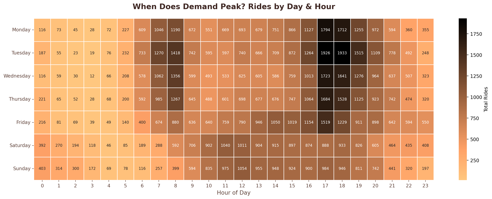
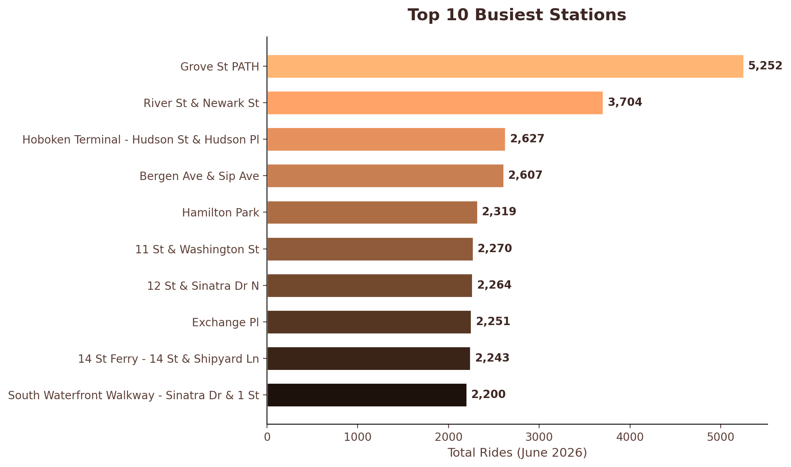
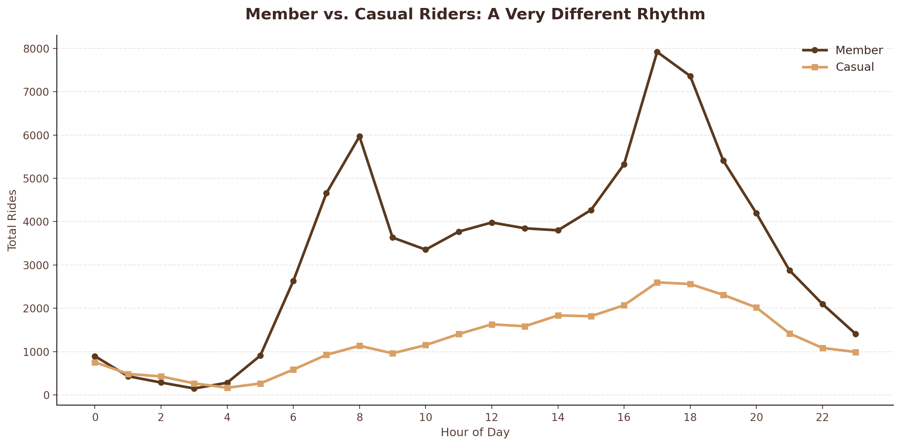

# Citi Bike (Jersey City) Demand Analysis

**Dataset:** [Citi Bike System Data](https://citibikenyc.com/system-data) — Jersey City, June 2026 (109,897 trips)

## Problem Statement
Identify peak demand times and locations for bike-share usage by analyzing trip-level data, in order to surface actionable insights for bike rebalancing and capacity planning, using SQL.

## Key Findings

1. **Weekday demand follows a sharp double-peak commuter pattern.** Rides spike at 8 AM (7,102 total) and again more sharply at 5 PM (10,518 total, the single busiest hour of the month) — separated by a comparatively quiet midday plateau.

2. **Weekend demand is flat and leisure-driven.** No rush-hour spike exists at all; usage instead forms a broad plateau from late morning through early evening, peaking at barely a quarter of the weekday peak (2,065 vs. 8,646 rides).

3. **The busiest stations are transit hubs, not residential areas.** Grove St PATH leads all stations by a wide margin (5,252 rides), followed by other transit-adjacent stations (Hoboken Terminal, Exchange Pl, 14 St Ferry) — reinforcing that this system is primarily used as a "last-mile" connector to trains and ferries.

4. **Members drive the rush-hour pattern; casual riders behave like leisure users even on weekdays.** At 8 AM, members outnumber casual riders more than 5-to-1. Members show a sharp double-peak matching the commuter pattern, while casual riders show a flat, gradually-rising curve resembling weekend behavior.

## Business Implication
Bike rebalancing efforts should be concentrated around transit-hub stations (especially Grove St PATH) ahead of the 5 PM peak — the point of highest system stress — with a separate, lighter-touch rebalancing strategy for weekends given the flatter, more distributed demand.

## Visualizations

### Demand Heatmap

### Top 10 Busiest Stations

### Member vs. Casual Rider Patterns

## Tools Used
SQL (SQLite), Python (pandas, matplotlib, seaborn)
